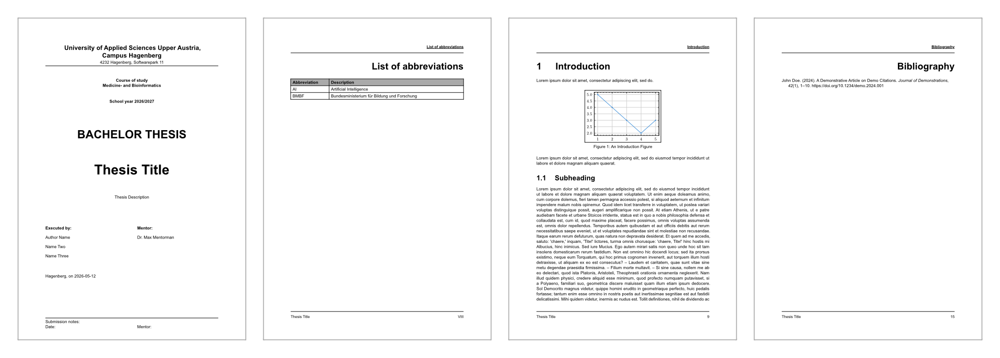

# Easy Hagenberg Thesis Template

Opinionated Typst template for bachelor and master theses (and related protocols) at University of applied sciences Upper Austria, with a focus on Campus Hagenberg.



## Quick start

(recommended) Create a new project from the official template, then view the generated `main.typ` for a full working example:

```bash
typst init @preview/easy-hgb-thesis
```

To import the package in an existing document:

```typ
#import "@preview/easy-hgb-thesis:0.2.0": full-thesis

#set document(
  title: "Thesis Title",
  author: "Author Name",
  description: "Thesis Description",
)
#set text(lang: "en")
#show: full-thesis.with(
  ...
)
```

## Intent

Typst makes professional-quality publishing simple and accessible for everyone. I believe more people should benefit from its power and ease of use.

I made this template because I couldn’t find a high-quality, flexible FH thesis template. My goal is to help anyone start their thesis with Typst quickly and easily, while also giving advanced users the freedom to customize the template however they need without unnecessary limitations.

Concretely, this template provides a practical, production-ready thesis layout with:

- pre-structured front matter and content flow
- sensible defaults for typography and page layout
- bilingual labels and declarations
- an extensible API for section-level and document-level styling

The package name is `@preview/easy-hgb-thesis`.

## Beware

This template is far from its finished state.
It will evolve based on user feedback and my experience with it as part of my bachelor thesis during the winter term 2026/27. Expect continuous improvements during this period.

## Customization

The template is well documented with inline comments and docstrings. Quick exploration should reveal most customization options.
The most important options are:

### Language support

The template supports **English (`en`)** and **German (`de`)**:
```typ
#set text(lang: "de")
#show: full-thesis.with(...)
```

### Style hooks

Import `full-thesis`, then customize appearance and structure by passing style hooks to `full-thesis.with(...)`, such as:

- `global-style` (fonts, page layout)
- `document-style` (overall document)
- `content-style` (main chapters)
- Section hooks: `abstract-style`, `outline-style`, `bibliography-style`, etc.

Defaults match typical FH thesis requirements. Override only what you need.

# Contributing

Feel free to open an issue or submit a pull request. See [CONTRIBUTING.md](CONTRIBUTING.md) for more details.
Even something simple like insights about your experience using the template is very valuable.
